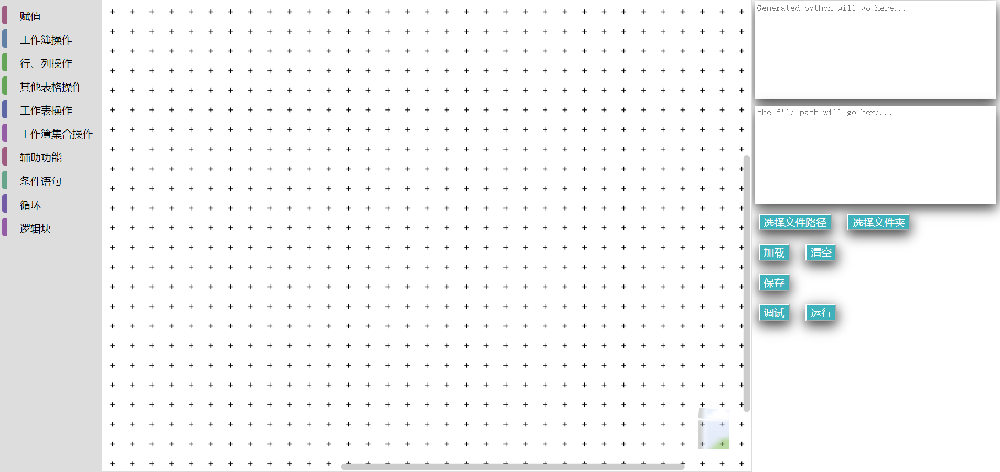
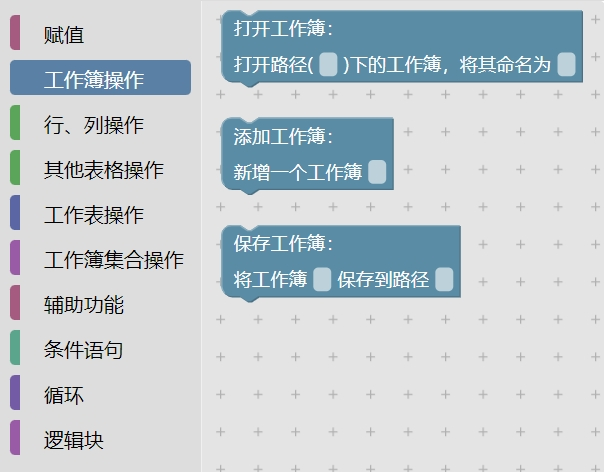
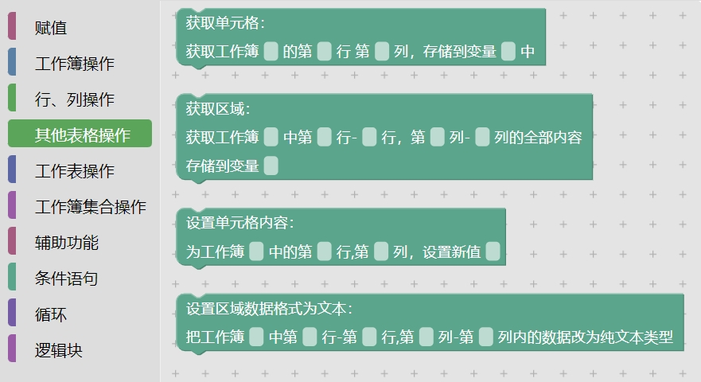
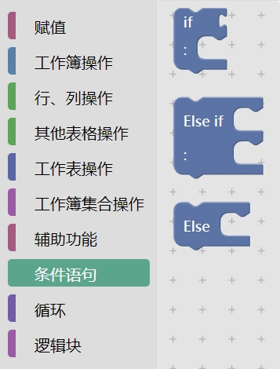
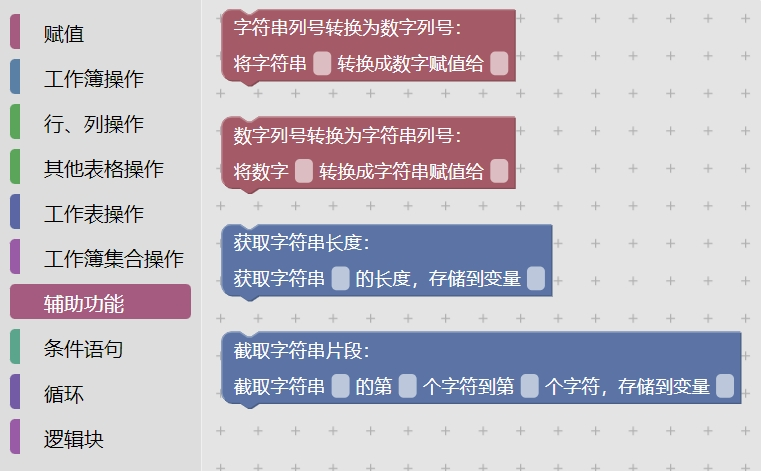

# 用户操作手册

  * [引言](#引言)
    + [1.1 编写目的]
    + [1.2 项目背景]
  * [软件概述](#软件概述)
    + [2.1 目标]
    + [2.2 功能]
  * [基础知识](#基础知识)
    + [3.1 块]
    + [3.2 常量与变量]
      - [3.2.1 常量]
      - [3.2.2 变量]
    + [3.3 数据类型]
      - [3.3.1 数字]
      - [3.3.2 字符串]
      - [3.3.3 列表]
      - [3.3.4 字典]
      - [3.3.5 衍生数据类型]
  * [使用说明](#使用说明)
    + [4.1 安装和初始化]
    + [4.2 具体功能]
      - [4.2.1 操作栏区]
      - [4.2.2 工作区]
      - [4.2.3 额外功能区]
  * [运行说明](#运行说明)
    + [5.1 运行表]
    + [5.2 运行步骤]
      - [5.2.1 操作信息]
      - [5.2.2 输入输出文件]
      - [5.2.3 启动恢复过程]
  * [故障排除](#故障排除)
    + [6.1 常见问题解答]
    + [6.2 联系支持]
  * [维护和更新](#维护和更新)
    + [7.1 平台维护]
    + [7.2 更新内容]

## 引言

### 1.1 编写目的

本用户操作手册旨在为财务部用户提供BlocklyRPA应用上的相关指导，以便工作人员更迅速更容易完成系统了解，熟悉相关操作。

### 1.2 项目背景
此项目是基于Blockly生成python代码内容，利用electron进行分发封装的RPA应用，用以解决繁杂重复的excel数据处理、数据清洗等问题，从而帮助NJU财务部门提高工作效率。  
Blockly是 Google 推出的一款可视化编程编辑器，使用拖放块来呈现相关的编码概念，使用所需的语言生成相对应的简洁代码，可编辑性强，灵活度高，支持生成JavaScript、python等多种不同语言的代码。
黄大伟同学负责Blockly部分，郭百川同学RPA部分

## 软件概述

### 2.1 目标

1、减少相关人员的学习成本，目前主流的RPA应用门槛高、学习成本高，非编码人员使用时需要的学习周期强且操作复杂，本项目想要通过Blockly等工具降低学习门槛，将原本的命令式程序语言转化为结构化程序语言，使得没有编程背景的工作人员也能够轻松上手掌握。  
2、提高相关RPA应用的可扩展性、可维护性，开发者可自由添加相关的功能语句块，对项目进行延伸，生成自身所需的Python代码，实现所需的excel操作；  
3、加强RPA应用语句的前后关联性，项目旨在添加对不同变量的关联，减少使用者的操作量，提高效率。  

### 2.2 功能

## 基础知识

请在使用该系统前先阅读本章。

### 3.1 块

块通常内含输入框，用于实现各项功能和控制执行顺序。

共分为三类块：功能块、控制块、逻辑块。

- 功能块：用于执行某个操作。
- 控制块：用于控制功能块的执行顺序，可以实现分支和循环。
- 逻辑块：用于辅助控制块进行判断。

使用块时，需要填写所有输入框。

### 3.2 常量与变量

本节介绍输入框可填入的文本类型：常量、变量、运算式。

#### 3.2.1 常量

对于仅在本块使用的数字或字符串数据，可以使用常量表示，例子可详见 ***基本数据类型*** 的 ***数字*** 和 ***字符串*** 部分。

#### 3.2.2 变量

对于需要在多个块使用的数据，可以使用变量表示。

每个变量都由一个变量名指代，变量名可由大小写字母、数字和下划线`_`组成，且不以数字开头，如：`i`、`salaryList8`、`tax_table`。

为了让程序具有更好的可读性，建议使用有实际意义的变量名。

#### 3.2.3 运算式

对于需要基本数据类型的输入框，可以在输入框中填写运算式，运算式由常量、变量、运算符组成，如：`(salary+25)*0.8`、`'南京'+'大学'`、`cityCodes['南京'] + 'Airport'` 。

每种基本数据类型支持的运算符可详见 ***基本数据类型***

### 3.3 数据类型

本节主要介绍系统涉及的四种基本数据类型：数字、字符串、列表、字典。

#### 3.3.1 数字

数字是可进行四则运算计算的数值数据，可由常量或变量表示，常量表示如：`10`、`0.123`、`0`、`-90.123`。

支持运算包括：

- 加 `+`
- 减 `-`
- 乘 `*`
- 除 `/`
- 括号 `()`

#### **3.3.2 字符串**

字符串是一串文本数据，可由常量或变量表示，常量表示如：`'123456789'`、`‘南京大学'`、`'D:\files\\excel'`。**应注意，需要加上单引号以表示字符串常量，否则输入框内的文本不会被解释为字符串常量。**

支持运算包括：

- 字符串拼接 `+`：如 `'南京' + '大学'` 的运算结果为 `'南京大学'`。

#### 3.3.3 列表

列表是一个数据序列，仅可由变量表示，一般由 Excel 读取功能得到，其中每一项都存有一个数据，数据可根据序号取出。

支持运算包括：

- 索引 `[]`：如 `salaryList[0]`、`nameList[3]`，取出列表中的其中一项，**应注意列表项序号从0开始**。

#### 3.3.4 字典

字典是一个带有索引的数据集合，仅可由变量表示，其中每一项都包含一个唯一索引和一个数据，数据可根据索引取出。

支持运算包括：

- 索引`[]`：如 `infoDict['姓名']`、`department['部门人数']`，根据索引取出字典中的其中一项。

#### 3.3.5 衍生数据类型

除上述基本数据类型外，本系统还包括若干衍生数据类型，这些数据类型与具体功能块相关，仅可由变量表示，具体介绍可详见相关功能块的介绍。

## 使用说明

### 4.1 安装和初始化
- 先解压指定的压缩包文件，在文件目录./out/make/squirrel.windows/x64/下找到可执行文件my-electron-app-1.0.0 Setup.exe，双击点击执行，等待安装完毕。
- 在初次安装后，即可在目录./out/my-electron-app-win32-x64/下双击可执行文件my-electron-app.exe进行使用。

### 4.2 具体功能

- 进入到应用界面，得到以上界面
- 左侧为操作栏，通过对Blockly块功能执行的不同进行分类；居中位置则为工作区，Blockly块在此完成组合；右侧则集成了不同功能，将在下文进行阐述。

#### 4.2.1 块选择区

此区域根据功能将块归为若干类，点击分类栏即可展开。

1. 第一栏为赋值操作区，目前只包含一个赋值语句块，负责将一个变量的内容交给另一个变量。  
    第一个输入框填写指定工作簿的对应变量名，第二个输入框填写得到赋值的变量名。

2. 第二栏为工作簿操作区，内含三个不同功能的Blockly块：  

    1. 打开工作簿：用于打开指定目录下的excel文件，并通过设置变量将其暂时存储在程序中，方便后续调用。  
        第一个输入框填写打开文件的绝对路径，第二个输入框则填写生成的变量名称。  

    2. 添加工作簿：新增一个空的工作簿，设置一个变量进行存储，可在后续和导出相关的函数进行操作。  
        第一个输入框填写excel文件对应的变量名。  

    3. 保存工作簿：将程序中变量对应的excel输出保存到指定目录中。  
        第一个输入框填写需要保存的excel文件对应的变量名，第二个输入框填写保存目录的绝对路径。 

        **注意保存路径需要带有包含后缀的完整文件名，且目前仅支持保存为xls格式**

        

3. 第三栏为工作簿集合操作区，内含六个不同功能的Blockly块：  

    1. 创建工作簿集合：创建一个空的工作簿集合。  
        第一个输入框填写工作簿集合对应的变量名。  

    2. 设置工作簿集合表头：对工作簿集合内的所有工作簿增加一行表头。  
        第一个输入框填写工作簿集合对应的变量名，第二个输入框填写生成表头所在的行号，第三个输入框填写表头内容对应的变量名。  

    3. 集合添加新行：往集合中任意一个指定的工作簿中添加新行。  
        第一个输入框填写集合对应的变量名，第二个输入框填写需要添加新行的工作簿名称，第三行填写新增行对应的变量名。  

    4. 设置集合列数据格式为文本：将集合内所有的工作簿指定列的格式更改为文本格式。  
        第一个输入框为集合对应的变量名，第二个输入框填写需要更改格式的列号。  

    5. 导出工作簿：将集合中的所有工作簿都导出到指定目录下。  
        第一个输入框填写集合对应的变量名，第二个输入框填写指定目录的绝对路径。  

    6. 获取工作簿名：获取指定集合下所有工作簿的名字内容，将其整合导入到一个列表中。  
        第一个输入框填写集合对应的变量名，第二个输入框填写导出存储工作簿名字的变量名。

4. 第四栏为行列操作，用于对指定工作簿进行各种行列操作，内含六个不同功能的Blockly块： 

    1. 获取行：以列表形式获取指定工作簿的指定行。  
        第一个输入框填写指定工作簿的对应变量名，第二个输入框填写指定的行号，第三和第四个输入框填写该行的列号范围，第五个输入框填写存储获取行内容列表的变量名。
    2. 获取行（有表头）：以字典形式获取指定工作簿的指定行。  
        第一个输入框填写指定工作簿的对应变量名，第二个输入框填写指定的行号，第三和第四个输入框填写该行的列号范围，第五个输入框填写存储行内容字典的变量名，第六个输入框填写表头所在的行号。
    3. 获取列：获取指定工作簿的指定列，存储为列表。  
        第一个输入框填写指定工作簿的对应变量名，第二个输入框填写指定的列号，第三和第四个输入框填写该列的行号范围，第五个输入框填写存储列内容列表的变量名。  
    4. 写入行：向指定工作簿中写入一行。  
        第一个输入框填写指定工作簿的对应变量名，第二和第三个输入框填写写入行的列号范围，第三个输入框填写指定的行号，第五个输入框填写行内容列表的变量名。
    5. 写入行（有表头）：向指定工作簿中写入一行，有表头。  
        第一个输入框填写指定工作簿的对应变量名，第二和第三个输入框填写写入行的列号范围，第三个输入框填写指定的行号，第五个输入框填写行内容字典的变量名，第六个输入框填写表头所在的行号。  
    6. 写入列：向指定工作簿中写入一列。  
        第一个输入框填写指定工作簿的对应变量名，第二和第三个输入框填写写入列的行号范围，第三个输入框填写指定的列号，第五个输入框填写列内容列表的变量名。 

5. 第五栏为其他表格操作区，内含四个不同功能的Blockly块：  

    1. 获取单元格：获得指定工作簿中指定位置的单元格，单元格位置由行列号决定。  
        第一个输入框填写指定工作簿的对应变量名，第二个输入框填写单元格所在行号，第三个输入框填写单元格所在列号，第四个输入框填写存储单元格内容的变量名。  

    2. 获取区域：获得指定工作簿中指定位置的单元格，区域范围由行列号决定。  
        第一个输入框填写指定工作簿的对应变量名，第二和第三个输入框填写区域的行范围，第四和第五个输入框填写区域的列范围，第六个输入框填写是否需要头部行，第七个输入框填写存储区域内容的变量名。  
    
        该功能会生成一个二维列表，即每一项都为一个列表的列表，可通过两个索引操作符`[]`获得内部的数据，其中第一个索引符指定行，第二个索引符指定列，如 `result[0][3]` 表示二维列表 `result` 中 0 号行、 3 号列的数据。
    
    3. 设置单元格内容：为指定工作簿下的指定单元格填充内容。  
        第一个输入框填写指定工作簿的对应变量名，第二个输入框填写单元格所在行号，第三个输入框填写单元格所在列号，第四个输入框填写要设置的内容。

    4. 设置区域数据格式为文本：将集合内所有的工作簿指定区域的格式更改为文本格式。  
        第一个输入框填写集合对应的变量名，第二个输入框和第三个输入框填写需要更改格式的区域的行范围，第四个输入框和第五个输入框填写需要更改格式的区域的列范围。 

6. 第六栏为工作表操作，内含三个不同功能的Blockly块：  

    1. 创建工作表：在指定工作簿内创建新工作表。  
        第一栏填写指定工作簿的对应变量名，第二栏填写创建工作表的名称。  

    2. 设置活跃工作表：设置指定工作簿的活跃工作表。  
        第一栏填写指定工作簿的对应变量名，第二栏填写创建工作表的名称。

7. 第七栏为条件语句，即基本的if-else语句，上方和下方接口为连接口，else块可以和if块连接形成完整语句，右上方接口为条件块，右下方为条件触发后的执行块，具体的if-else语法已在定义中做出解释，不再赘述。  
   
8. 第八栏为循环语句，内含两个循环语句，右方接口为执行块连接口，for循环语法已在定义中做出解释，不再赘述。  
   
9. 第九栏为辅助功能，用于辅助数据操作及修改，内含两个不同功能的Blockly块：

    1. 字符串列号转换为数字列号：将字符串列号转换成数字，如 `'A'` 转换为 `1`。  
        第一个输入框填写列号对应的变量名，第二个填写得到数字化列号的变量。  

    2. 数字列号转换为字符串列号：将数字列号转换成字符串，如 `1` 转换为 ``A``。  
        第一个输入框填写数字对应的变量名，第二个填写得到字符串化的数字变量。

    3. 获取字符串长度：获取当前字符串的长度，并存储到变量中。
        第一个输入框填写字符串的长度，第二个填写存储内容的变量名。

    4. 截取字符串片段：截取所给字符串的片段，具体长度及内容由截取的下标位置决定，并且存储到变量中。
        第一个输入框填写字符串名，第二个输入框填写截取的头位置，第三个输入框填写截取的尾位置，第四个输入框填写存储内容的变量名

10. 第十栏为逻辑块区，基本用于if语句的条件判断，包含了基本的条件运算：判空、大于、等于、小于、不等于、且、或、非：

#### 4.2.2 工作区
- 工作区即为界面中央黑色十字平铺的大部分区域，主要用于拖动组合各种Blockly块，另外也加载了一部分特有功能，现进行说明。
    
- 右键的快捷键设置，在鼠标指针不指向具体块时，包含以下五个常用功能，回退（Undo）、前进（Redo）、整理工作区（Clean up Blocks）、折叠工作区块（Collapse Blocks）、展开工作区块（Expand Blocks）。  
回退和前进的触发条件和应用场景等同于其他具有该功能的应用，不再赘述。  
整理工作区则是用于整理场景块杂乱的问题，触发条件为工作区内有两个及以上的未连接块，其会根据Blockly块的上下位置进行从上到下居左排列，效果图如下：
  
  
折叠工作区块和展开工作区块的效果则是相对的，点击折叠/展开会同时对工作区内所有的块进行折叠/展开。  
  
- 在鼠标指向具体块时，则会有8个常有功能：复用（Duplicate）、添加/移除注释（Add/Remove Comment）、折叠/展开块（Collapse/Expand Blocks）、隐藏/再现块（Disable/Enable Block）、删除块（Delete Block）。  
复用会在原地再生成一个相同的块。  
添加/移除注释则能在块上生成/移除一个蓝色问号，鼠标指针指向蓝色问号即可对当前块进行注释。  
折叠/展开块与全局的展开折叠并无太大区别，唯一区别为该操作只对当前选中块生效。  
隐藏块可在不删除当前块的情况下，让其不参与代码的生成和具体功能的运行，再现块则能使隐藏起来的块再次回到正常状态。 
删除块即为删除当前块。
  
- 此外，工作区右下方还加载了垃圾桶功能，可通过将垃圾桶中的块再次拖出进行使用。
### 4.2.3 额外功能区
- 界面右侧则为附加功能区，包含两个文本框及6个按钮，现对其进行说明：  
 两个文本框分别负责代码生成和路径生成，靠上的为代码生成，靠下的则为路径生成。代码生成用于开发人员的测试工作，与具体功能无关；而路径生成则需结合“选择文件路径”和“选择文件夹”两个，点击上述两个按钮并选择文件/目录，会在下方文本框内生成选中的绝对路径，帮助使用者构建路径。  
   “保存”按钮的功能为保存当前工作区的所有块，点击之后会要求用户选择路径，其会在该目录下生成一个用户指定名字的json文件，用于保存。
   “加载”按钮用于加载已经保存和处理好的块，点击之后选择对应的json文件，即可加载之前保存的功能块。
   “清空”按钮则会将工作区的全部块进行删除，删除的内容都会暂存在回收站中。
   “调试”按钮的功能对应于代码生成的文本框，点击之后即可将工作区的块集合生成的代码打印到上方文本框中，与具体功能无关。  
   “运行”按钮则会直接运行当前工作区完成的功能内容。    
## 运行说明

## 故障排除

### 5.1 常见问题解答

- 登录遇到问题时，确保输入正确的用户名和密码。
- 提交操作遇到问题时，检查输入的信息是否符合要求。
- 系统错误提示时，尝试刷新页面或重新登录。

### 5.2 联系支持

- 如遇到无法解决的问题，请联系黄大伟（958902573@qq.com）和郭百川（201220087@smail.nju.edu.cn），提供详细的问题描述和相关信息，以便快速解决问题。

## 维护和更新

### 6.1 应用维护

- 定期进行系统的维护和升级，以确保应用的稳定性和安全性。

### 6.2 更新内容

- 随着应用的发展和用户需求的变化，可能会推出新的功能和改进，用户可以及时了解更新内容，并根据需要进行升级。

